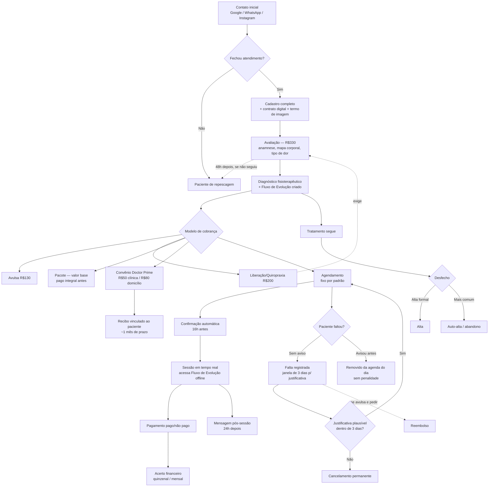

### 10.6 Diagrama

```mermaid
flowchart TD
    A[Contato inicial<br/>Google / WhatsApp / Instagram] --> B{Fechou atendimento?}
    B -- Não --> C[Paciente de repescagem]
    B -- Sim --> D[Cadastro completo<br/>+ contrato digital + termo de imagem]
    D --> E[Avaliação — R$330<br/>anamnese, mapa corporal, tipo de dor]
    E -. 48h depois, se não seguiu .-> C
    E --> F[Diagnóstico fisioterapêutico<br/>+ Fluxo de Evolução criado]
    F --> G{Modelo de cobrança}
    G --> G1[Avulsa R$130]
    G --> G2[Liberação/Quiropraxia R$200]
    G --> G3[Pacote — valor base<br/>pago integral antes]
    G --> G4[Convênio Doctor Prime<br/>R$50 clínica / R$80 domicílio]
    G2 -. exige .-> E
    G --> H[Agendamento<br/>fixo por padrão]
    H --> I[Confirmação automática<br/>16h antes]
    I --> J[Sessão em tempo real<br/>acessa Fluxo de Evolução offline]
    J --> K[Pagamento pago/não pago]
    J --> L[Mensagem pós-sessão<br/>24h depois]
    H --> M{Paciente faltou?}
    M -- Sem aviso --> N[Falta registrada<br/>janela de 3 dias p/ justificativa]
    N --> O{Justificativa plausível<br/>dentro de 3 dias?}
    O -- Sim --> H
    O -- Não --> P[Cancelamento permanente]
    M -- Avisou antes --> Q[Removido da agenda do dia<br/>sem penalidade]
    N -. se avulsa e pedir .-> R[Reembolso]
    K --> S[Acerto financeiro<br/>quinzenal / mensal]
    G4 --> T[Recibo vinculado ao paciente<br/>~1 mês de prazo]
    F --> U[Tratamento segue]
    U --> V{Desfecho}
    V -- Alta formal --> W[Alta]
    V -- Mais comum --> X[Auto-alta / abandono]
```

---